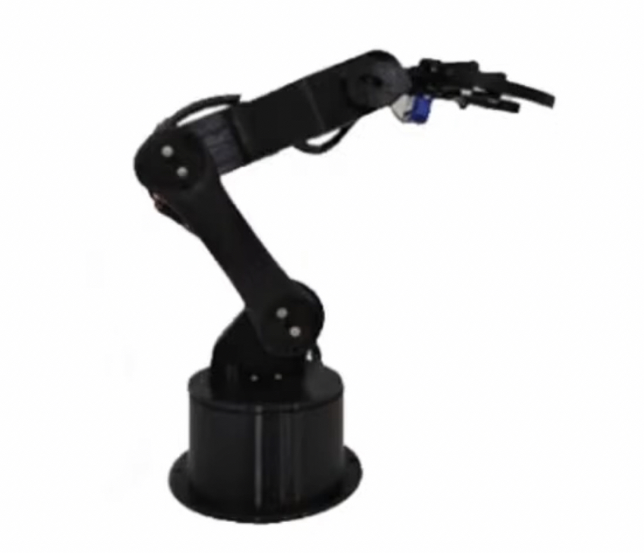

# Robotic-Arm-system-for-loading-and-unloading
create a system from many steps for loading and unloading

### step 1
Place the arm close to the place where the object to be carried is so that it can reach it.

### step 2
Putting the thing to be carried in the specified place so that it has a certain weight and shape that the arm can carry
 
### step 3
The arm is wrapped in a smart way with several axes so that it can reach the purpose and is fixed by a specific mechanism in the arm
### step 4
The arm is moved to the desired location and lowered for the specific purpose
